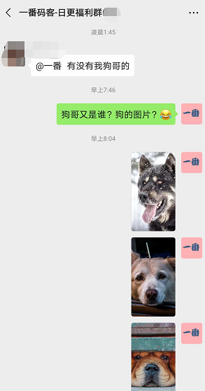
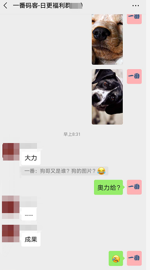
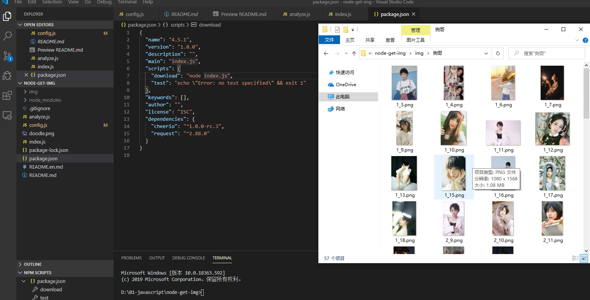

> **一番码客 : 挖掘你关心的亮点。**
> **http://www.efonmark.com**

本文目录：

[TOC]

<!-- more -->

## 前言

昨天一番发了一篇批量下载手机壁纸的文章，分享了抓取到的美图给小伙伴，然后一番就美美的去碎觉了。

早上起来看到有小伙伴在**日更群**里说有没有狗哥的？憨憨的一番以为就是狗的图片，于是就发了几张昨天抓取的狗的图片。

在群友的帮助下，一番才知道是爱情公寓里的一个演员。

小伙伴有需求，一番本着力所能及的帮助他人的公众号思想，当然不能用纯粹出卖劳力，于是度娘了一番，然后找到一个不错的开源项目。然后花了差不多1两个小时改bug，完善了一下，最终抓取了五六十张狗哥的图。

## 环境准备

* win10 + nodejs
* 项目地址：『https://gitee.com/melissayan/node-get-img』

## 思路方法

* 用`fs`模块保存文件。
* 用`path`模块处理文件查找和路径处理。
* 用`request`模块请求网络，从返回的数据中解析`DOM`获得出图片地址。
* 模块化：anayze（解析文件）、config（动态配置文件）、index（主文件）。

## 效果展示

如果电脑安装了nodejs环境，运行这个项目就很简单了。

先`node install`安装`package.json`中的依赖，配置好想要下载的网页地址，然后`node index.js`就可以直接执行了~。效果是这样的：

## 资源获取

### 代码

一番**个人微信号**回复：『**A0002**』。

原项目代码有些bug，一番修复了，如上操作获取最新代码。

### 狗哥图片

一番**个人微信号**回复：『**A0003**』。

> 一番雾语：今天一番会个次条，多搞笑动图~，希望大家开心~

<table>
<tr>
<td >

</td>
<td width="50%" align=left><b>
    免费知识星球：<a href="http://www.efonmark.com/efonmark-blog/readme/zhishixingqiu1.png">一番码客-积累交流</a> 
    微信公众号：<a href="http://www.efonmark.com/efonmark-blog/readme/guanzhu_1.jpg">一番码客</a> 
    微信：<a href="http://www.efonmark.com/efonmark-blog/readme/weixin.jpg">Efon-fighting</a> 
    网站：<a href="http://www.efonmark.com">http://www.efonmark.com</a> </b></td>
</tr>
</table>