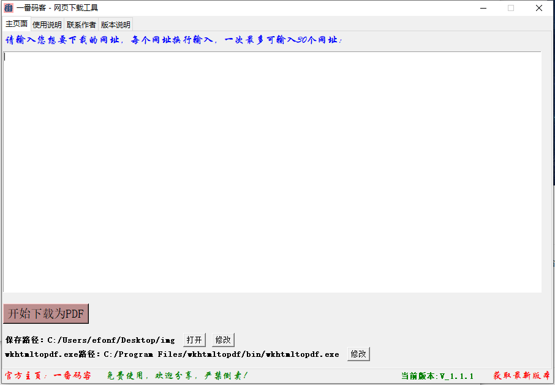

> **一番码客 : 挖掘你关心的亮点。**
> **http://www.efonmark.com**

本文目录：

[TOC]

<!-- more -->

## 网页下载工具

* 发布版本：V_1.1.1。
* 大小10M，绿色无需安装，一个exe走天下。

### 软件界面

### 版本说明

1. url转PDF保存到本地。
2. 下载进度展示栏。
3. 保存目录的选择、展示、打开。
4. 获取最新版本链接。
5. wkhtml和保存路径可保存。

### 功能说明

1. 输入批量网址，将网址转换为pdf保存到本地。
2. 一次最多支持30个网址下载。
3. 如有无法访问网址，将自动跳过。

### 使用说明

1. 首先安装wkhtml2pdf.exe，采用默认安装即可。
2. 请输入您想要下载的网址，每个网址换行输入。
3. 点击“开始下载为PDF”，可以看到下载进度。 
4. 保存路径默认为当前路径，可以点击“修改”设置为其他目录。 
5. 如果提示“请选择正确的wkhtmltopdf.exe路径”，点击“修改”设置wkhtmltopdf.exe安装路径。
6. wkhtmltopdf.exe默认安装路径为C:/Program Files/wkhtmltopdf/bin/。

### 软件获取

百度盘链接：https://pan.baidu.com/s/1BxWu-o60SvNJDc8teHdikg 
提取码：3tjq

如有失效，请访问一番官网获取，或者联系一番微信获取~

## 今日一番

今天一番从早上七点开始干，一直到晚上10点，最后关头还差点操作失误删了所有源码😂，当时整个人都崩溃了。咆哮了几分钟之后，发现IDE还有缓存，终于找回了代码，今晚能发布出来。

软件有了基本功能和比较好的用户交互，但有些网址下载体验不佳，所以还有很多需要完善的，后面会持续更新。

> 一番雾语：批量导出网址为pdf文件保存到本地。

<table>
<tr>
<td >

</td>
<td width="50%" align=left><b>
    免费知识星球：<a href="http://www.efonmark.com/efonmark-blog/readme/zhishixingqiu1.png">一番码客-积累交流</a> 
    微信公众号：<a href="http://www.efonmark.com/efonmark-blog/readme/guanzhu_1.jpg">一番码客</a> 
    微信：<a href="http://www.efonmark.com/efonmark-blog/readme/weixin.jpg">Efon-fighting</a> 
    网站：<a href="http://www.efonmark.com">http://www.efonmark.com</a> </b></td>
</tr>
</table>