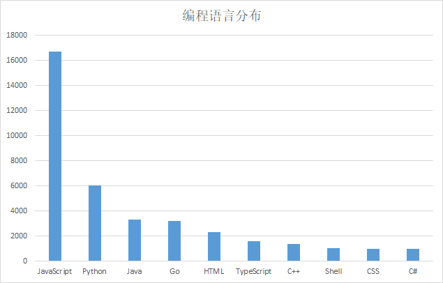

> **一番码客 : 挖掘你关心的亮点。**
> **http://efonfighting.imwork.net**

本文目录：

[TOC]

## 前言

当世界大部分人都还在问“区块链是什么”的时候，部分程序员已经深耕许多年了。

要全面学习区块链的相关知识，作为程序员最大社交社区的GitHub是做好不过的选择了。

想要学习、了解区块链，先问问程序员们。今天一番盘点下GitHub上的那些区块链项目。

<!--more-->

## 编程语言分布

上面是分布前十的编程语言，可见rust、solid等早期的区块链编程语言已经不是主流了，最多的是javascript，可见javascript的生命力确实很强。

## star前十

* [ethereum/go-ethereum](https://github.com/ethereum/go-ethereum)

  > 描述：Official Go implementation of the Ethereum protocol
  > star：24.7k

* [chaozh/awesome-blockchain-cn](https://github.com/chaozh/awesome-blockchain-cn)

  > 描述：收集所有区块链(BlockChain)技术开发相关资料，包括Fabric和Ethereum开发资料
  > star：14.3k

* [bitcoinbook/bitcoinbook](https://github.com/bitcoinbook/bitcoinbook)

  > 描述：Mastering Bitcoin 2nd Edition - Programming the Open Blockchain
  > star：12.7k

* [amark/gun](https://github.com/amark/gun)

  > 描述：A realtime, decentralized, offline-first, graph protocol to sync the web.
  > star：10.7k

* [dipakkr/A-to-Z-Resources-for-Students](https://github.com/dipakkr/A-to-Z-Resources-for-Students)

  > 描述：Curated list of resources for college students
  > star：9.3k

* [hyperledger/fabric](https://github.com/hyperledger/fabric)

  > 描述：Read-only mirror of https://gerrit.hyperledger.org/r/#/admin/projects/fabric
  > star：9k

* [trufflesuite/truffle](https://github.com/trufflesuite/truffle)

  > 描述：A tool for developing smart contracts. Crafted with the finest cacaos.
  > star：8.3k

* [ethereum/solidity](https://github.com/ethereum/solidity)

  > 描述：Solidity, the Contract-Oriented Programming Language
  > star：7.4k

* [ethereum/mist](https://github.com/ethereum/mist)

  > 描述：[DEPRECATED] Mist. Browse and use Ðapps on the Ethereum network.
  > star：7.3k

* [ethereumbook/ethereumbook](https://github.com/ethereumbook/ethereumbook)

  > 描述：Mastering Ethereum, by Andreas M. Antonopoulos, Gavin Wood
  > star：6.2k

## 中文资源

* [chaozh/awesome-blockchain-cn](https://github.com/chaozh/awesome-blockchain-cn)
  > 描述：收集所有区块链(BlockChain)技术开发相关资料，包括Fabric和Ethereum开发资料
  > star：14.3k

* [LiuBoyu/blockchain](https://github.com/LiuBoyu/blockchain)
  > 描述：区块链 - 中文资源
  > star：4.2k

* [itheima1/BlockChain](https://github.com/itheima1/BlockChain)
  > 描述：黑马程序员 120天全栈区块链开发 开源教程
  > star：2.2k

* [imfly/bitcoin-on-nodejs](https://github.com/imfly/bitcoin-on-nodejs)
  > 描述：《Node.js区块链开发》（网名《Nodejs开发加密货币》）注：新版代码已开源！
  > star：2.1k

* [tianmingyun/MasterBitcoin2CN](https://github.com/tianmingyun/MasterBitcoin2CN)
  > 描述：《精通比特币》第二版 区块链研习社 云天明联合出品
  > star：735

* [dily3825002/awesome-blockchain](https://github.com/dily3825002/awesome-blockchain)
  > 描述：区块链白皮书、书籍、交易所、币种、自媒体等资源汇总 💯
  > star：658

* [blockchain-university/databank](https://github.com/blockchain-university/databank)
  > 描述：区块链技术相关的论文、文档
  > star：628

* [33cn/chain33](https://github.com/33cn/chain33)
  > 描述：高度模块化, 遵循KISS原则的区块链开发框架
  > star：330

* [WeBankFinTech/WeIdentity](https://github.com/WeBankFinTech/WeIdentity)
  > 描述：基于区块链的符合W3C DID和Verifiable Credential规范的分布式身份解决方案
  > star：313

* [cinoliu/Organization-circle](https://github.com/cinoliu/Organization-circle)
  > 描述：微信小程序-组织圈(小程序(引流能力)+区块链(智能合约))+ 身份链
  > star：306

* [wumansgy/GoAndBlockChainStudy](https://github.com/wumansgy/GoAndBlockChainStudy)
  > 描述：go and blockchain study note，欢迎各位志同道合的朋友一起完善，让更多的go或者区块链开发者能够有一份不错的学习资料
  > star：295

* [anotheros/learn-blockchain](https://github.com/anotheros/learn-blockchain)
  > 描述：有编程基础学习区块链 写给产品和开发的一本区块链书
  > star：272

* [xiaolai/blockchainlittlebook.com](https://github.com/xiaolai/blockchainlittlebook.com)
  > 描述：区块链小白书
  > star：269

* [xianfeng92/Love-Ethereum](https://github.com/xianfeng92/Love-Ethereum)
  > 描述：区块链学习
  > star：248

* [cinoliu/Blockchain-SCRM](https://github.com/cinoliu/Blockchain-SCRM)
  > 描述：区块链的功能性智能合约SCRM系统
  > star：241

* [hackstoic/road2blockchain](https://github.com/hackstoic/road2blockchain)
  > 描述：180天搞懂区块链。 区块链的浪潮已来， 当一个弄潮儿，随时准备冲上浪潮之巅。
  > star：236

* [OpensourceBooks/blockchain](https://github.com/OpensourceBooks/blockchain)
  > 描述：开源教程：从零开始写区块链
  > star：222

* [WeBankFinTech/WeEvent](https://github.com/WeBankFinTech/WeEvent)
  > 描述：Event-Driven Architecture Based on Blockchain.基于区块链的事件驱动架构
  > star：215

* [gymgle/blockchain-reference](https://github.com/gymgle/blockchain-reference)
  > 描述：区块链参考资料
  > star：205

## 总结

中文资料相对而言要少一点，所以学习上面的项目再配合一些市面上的书籍会比较全面。

因此也可以看出，中文相关的资料在github上还有一定的机会，哪怕是将star最多的做翻译工作。

## 今日一番

2019的最后一个季度了，一番思考了下职业的规划发展，定了最后这一个季度里的重点任务：工作绩效A，区块链学习、electron开发（基于公众号工具）。

如何有目标的安排事务：

- 为了长期目标，我未来5年应该做的最重要的一件事是什么？
- 为了5年目标，我今年应该做的最重要的一件事是什么？
- 为了今年的目标，我本月应该做的最重要的一件事是什么？
- 为了本月的目标，我本周应该做的最重要的一件事是什么？
- 为了本周的目标，我今天应该做的最重要的一件事是什么？
- 为了今天的目标，我现在应该做的最重要的一件事是什么？

> **一番雾语：用迭代思维去看书。**

-------------

> **免费知识星球： [一番码客-积累交流](http://efonfighting.imwork.net/efonmark-blog/%E7%AE%80%E4%BB%8B/zhishixingqiu1.png)**
> **微信公众号：[一番码客](http://efonfighting.imwork.net/efonmark-blog/%E7%AE%80%E4%BB%8B/guanzhu_1.jpg)**
> **微信：[Efon-fighting](http://efonfighting.imwork.net/efonmark-blog/%E7%AE%80%E4%BB%8B/weixin.jpg)**
> **网站： [http://efonfighting.imwork.net](http://efonfighting.imwork.net)**