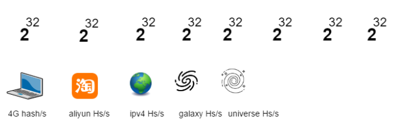
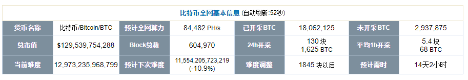

> **一番码客 : 挖掘你关心的亮点。**
> **http://www.efonmark.com**

本文目录：

[TOC]

### 初识hash函数

>  **Hash（“原文”）=“密文”**

<!--more-->

* 基本概念：
  * 哈希函数，也称散列函数。
  * 更像是一种思想，没有一个固定公式。
  * 只要符合散列思想的的算法都可以成为哈希函数。

- 唯一性：
  - 世界上没有完全相同的两片叶子，每一件事物都有自己的特征。
  - Hash函数可以提取数据的特征。
  - 将任意原文生成固定长度的唯一的密文。
  - 任意原文 → hash函数处理 → 唯一的固定长度的密文。
- 不可逆：
  - 不能通过密文推算出原文内容。

### hash函数的作用

- 隐私问题
  - 用hash函数来提取该事物的特征码,用sha256甚至以上来保证不被破解。
- 快速对账问题
  -  分布式现金系统,数字化货币一定要解决的问题。
  -  hash来解决快速对账问题,同样的内容的sha256一定是一样的。

### hash算法的安全性

#### 常见的Hash算法

##### MD5

```shell
MD5("efonmark")=08c4c0b7fb85ec581ade87563762a08f
```

* 长度
  * 16进制：32位
  * 2进制：128位
* 可能性
  * 2<sup>128</sup>
* 安全性
  * 可穷举，不安全

##### SHA1

```shell
SHA1("efonmark") = 3b9c6146dd3f0a4b613e530b0bf8124b9337bc46
```

* 长度
  * 16进制：40位
  * 2进制：160位
* 可能性
  * 2<sup>160</sup>
* 安全性
  * 不安全
  * 谷歌发现首个哈希碰撞：两个文件的SHA1值完全一样。
  * 目前只有sha1出现了哈希碰撞。

##### SHA256

```shell
SHA256("efonmark") = e233d59a649adfde5c3360d4f7a82c611531373642be013515550f994309ca57
```

* 长度
  * 16进制：64位
  * 2进制：256位
* 可能性
  * 2<sup>256</sup>
* 安全性
  * 目前高算力个人计算机：每秒2<sup>32</sup>次hash。
  * 淘宝全网算力：每秒2<sup>64</sup>次hash。
  * 全球所有ipv4地址都有一个淘宝算力：每秒2<sup>96</sup>次hash。
  * 整个银河系所有星球，每个星球都有ipv4个淘宝算力：每秒2<sup>128</sup>次hash。
  * 整个宇宙所有星球，每个星球都有ipv4个淘宝算力：每秒2<sup>160</sup>次hash。
  * 整个宇宙所有星球，每个星球都有ipv4个淘宝算力，穷举完需要2.5*10<sup>21</sup>年。



#### 哈希碰撞

* 原文无固定长度，无边界。
* 密文有固定长度，有边界。
* 理论上讲两个不同原文可能产生同一密文，只是概率极低。
* 暴力穷举可产生哈希碰撞。
* 挖矿
    * 比特币挖矿：穷举产生小于某个值的hash值。
    * 比特币算力：



### 钱包的创建

* 创建条件
  * 无需网络
  * 无需服务商
  * 甚至可以无需电脑(算盘)
* 冷钱包：生成的私钥不存储在电脑、网络世界中。

### 参考

* 百度百科

  >  https://baike.baidu.com/item/Hash/390310 

* 黑马程序员 120天全栈区块链开发 开源教程

  > https://github.com/itheima1/BlockChain

----

> **一番雾语：**数学密码学还是非常有意思的。

----------

> **免费知识星球： [一番码客-积累交流](http://www.efonmark.com/efonmark-blog/readme/zhishixingqiu1.png)**
> **微信公众号：[一番码客](http://www.efonmark.com/efonmark-blog/readme/guanzhu_1.jpg)**
> **微信：[Efon-fighting](http://www.efonmark.com/efonmark-blog/readme/weixin.jpg)**
> **网站： [http://www.efonmark.com](http://www.efonmark.com)**