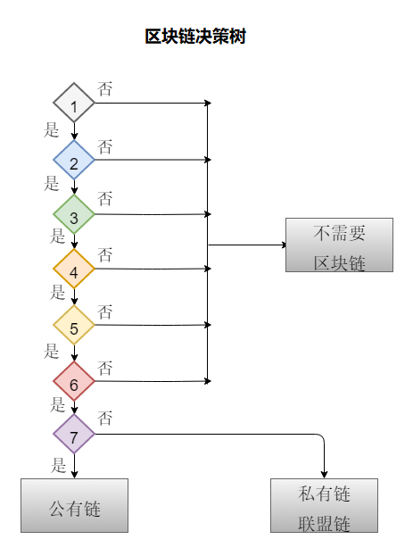

> **一番码客 : 挖掘你关心的亮点。**
> **http://www.efonmark.com**

本文目录：

[TOC]

<!--more-->

### 项目到底需不需要区块链技术

**区块链不是万能的**，我们在应用阶段的时候，如何判断是否真的需要使用到区块链技术？

#### 区块链的错误说法

- 区块链就是去中心化
- 颠覆权威，颠覆中央

#### 区块链应用有自己的使用场景

- 有共享通用数据库的需要；
- 流程设计的参与方存在激励冲突，或者在参与方之间没有信任；
- 一个数据库有多方参与或者有多个写入者；
- 现在由受信任的第三方参与的流程，例如托管服务、数据提供服务、发放牌照的权威以及公证人；
- 密码学正在被使用或者应当被使用。密码学促进数据保密，数据完整性，权威性以及不可复制性；
- 一个商业流程的数据在整个流程中被导入许多不同的数据库；
- 系统中的参与者受到统一的稳定的规则制约；
- 各方的决策是透明的而不是保密的；
- 有对客观、不可更改的历史，或者对各方指定的事实有日志的需求；
- 交易频次不超过10，000次/秒。

#### 区块链不适合的应用场景

- 业务场景设计机密数据

  > 机密数据
  >
  > 区块链上的数据是在全部节点同步记账

- 业务过程存储大量的静态数据，或者数据非常大

  > 区块链数据在每个节点上同步备份

- 交易规则经常变化

  > 机器执行，重建信任
  >
  > code is law

- 使用外部或者第三方服务来收集/存储数据

- 需要跨链交互数据

  > 智能合约和中心数据库（oracle等）

- 简单业务场景

  > 个人博客
  >
  > 聊天室
  >
  > 留言板
  >
  > 日记本

#### 区块链决策树

1. 是否需要共享数据
2. 是否有多个组织和个人参与
3. 组织和个人之间是否有利益交互且互不信任
4. 组织和个人间是否有统一规则管理
5. 交易记录是否需要追踪溯源
6. 组织个人之间的交易规则是否不频繁修改
7. 交易是否数据公开

### 区块化的可行性评估

- 技术可行性：看是否能够变成代码语言
- 成本可行性：此为区块链的代价

  * 计算成本
  * 存储成本
  * 安全成本
  * 隐私成本
  * 易用性成本
- 政策可行性：是否符合政策规定

### 这些项目是否靠谱

#### 伪区块链需求项目

- 区块链名酒防伪：每瓶酒都在区块链上唯一记录  ；区块链验证酒的真伪。

  > 不可行：因为酒厂是不可替代的中心，最终的验证指向都是酒厂，不能线下转为线上，且不能去中心化。

- 区块链电影票：每张电影票唯一记录；电影票都验证入场计入区块链。

  > 不可行：电影院是不可替代的中心。

- 区块链快递？

- 区块链公司账务？

- 区块链学生信息？

- 汽车保险？

  > 人为因素较多，无法量化

#### 前景区块链项目

- 众筹

- 投票

- 拍卖所

- 发行货币

  > 需要考虑各地政策。

- 发行ico，daico

  > 需要考虑各地政策。

- 赌场

  > 需要考虑各地政策。

### 区块链的应用场景

- 金融服务

  - 银行业（corda、微众银行）
  - 证券交易
  - 众筹

- 征信权属管理

  - 征信管理
  - 权属管理
  - 音乐版权保护

- 资源共享

  - 共享单车
  - 社会能源共享
  - 电商平台
  - 大数据共享
  - 减少共享的风险

- 贸易管理

  - 跨境贸易（swift）
  - 物流供应链
  - 一带一路

- 物联网

  * IBM

  * Fiament

  * NeuroMesh(物联网疫苗)

  * 公共网络服务  

- 其他应用场景

  - 云存储
  - 医疗
  - 通讯软件
  - 电子游戏
  - 投票

前景项目举例：

* Augur：全球预测系统（菠菜）， 基于以太坊。
* Slock：全球共享系统，共享一些Blockchain + internet of things，取
  代共享单车 p2p。
* Ujo music：音乐版权，听众到音乐家。
* Akasha：社交平台，取代facebook，知识付费。
* Ipfs：星云存储系统， 取代http。

### 参考

* [1]黑马程序员 120天全栈区块链开发 开源教程

  > https://github.com/itheima1/BlockChain

----

> **一番雾语：**全方位细致评估决策，稳健实施。

----------

> **免费知识星球： [一番码客-积累交流](http://www.efonmark.com/efonmark-blog/readme/zhishixingqiu1.png)**
> **微信公众号：[一番码客](http://www.efonmark.com/efonmark-blog/readme/guanzhu_1.jpg)**
> **微信：[Efon-fighting](http://www.efonmark.com/efonmark-blog/readme/weixin.jpg)**
> **网站： [http://www.efonmark.com](http://www.efonmark.com)**