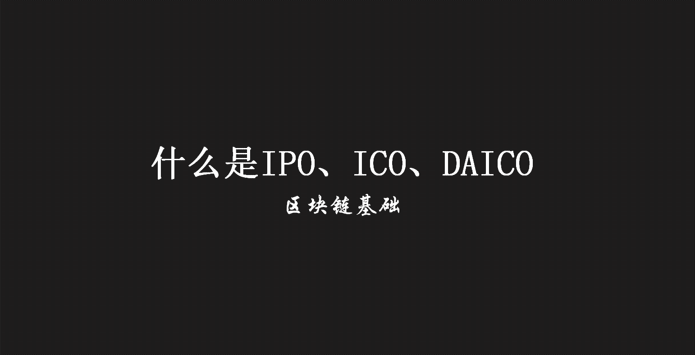
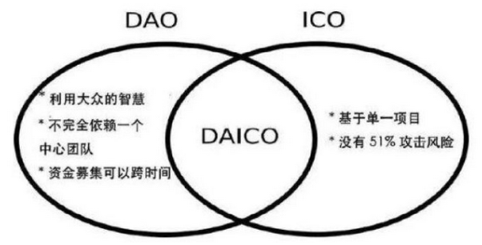

> **一番码客 : 挖掘你关心的亮点。**
> **http://www.efonmark.com**

本文目录：

[TOC]

<!--more-->

## IPO

- IPO(Initial Public Offerings)，英文翻译就是首次公开发行。
- 什么叫做发行呢，增发股票就是发行。换句话说就是让新的、更多的投资者把钱投资到公司里面来。同时给这些投资者一些公司股份。允许他们以后参加企业的分红。

## ICO

- ICO(Initial Coin Offerings)，英文翻译就是首次货币发行。

    - 这里先简单的理解一下， 货币就是固定充当一般等价物的特殊商品。

    - 人民币是我国政府发行，美元是美国政府发行。

    - 理发店可能发行一个小红花， 剃头一次送一个小红花，集齐5朵小红花就可以送一次免费剃头。

    - 便利店可能发行全家会员积分， 积分100可以当1元钱使用。

    - 从广义上讲， 小红花和积分也是货币。

- ICO的方式就是， 企业先发布一个白皮书，白皮书就是说我们打算干一件什么事， 现在没钱， 大家来买代金券。

|                |       IPO        |      ICO       |
| :------------: | :--------------: | :------------: |
|      门槛      | 门槛高，政府监管 | 无门槛，无监管 |
|   投资人获得   |       股票       |    数字货币    |
|     涨跌幅     |     10%每天      |     无限制     |
|      风险      |       一般       |      超高      |
| 投机发财可能性 |        低        |       高       |
| 血本无归可能性 |        低        |      超高      |
|    政府态度    |       承认       |     不承认     |
|    法律状态    |       合法       |  非法集资嫌疑  |

## 新模式DAICO

- 什么是DAO

    - Decententralize Autonomous Oganization，去中心化自治组织。
    - 去中心化与中心化类比：类似海星和蜘蛛。

    * Code is law  

- 什么是DAICO

    >  https://ethresear.ch/t/explanation-of-daicos/465

    

    - 这是对ICO筹资模式的改进，它融合了DAO的某些方面。

    - 三元素

        > 首先，完全信任，完全放在一个集中的团队上。从一开始就决定资金是由民主投票制度决定的。
        >
        > 其次，资金不是一次性发放，而是实施一种机制来随时间推移发放。
        >
        > 最后，有机会退还捐款。这个决定是基于“人群的智慧”，即如果团队未能实施项目，贡献者可以投票退还剩余的财务。

## 参考

* 黑马程序员 120天全栈区块链开发 开源教程

  > https://github.com/itheima1/BlockChain

----

> **一番雾语：代码即规则。**

----------

> **免费知识星球： [一番码客-积累交流](http://www.efonmark.com/efonmark-blog/readme/zhishixingqiu1.png)**
> **微信公众号：[一番码客](http://www.efonmark.com/efonmark-blog/readme/guanzhu_1.jpg)**
> **微信：[Efon-fighting](http://www.efonmark.com/efonmark-blog/readme/weixin.jpg)**
> **网站： [http://www.efonmark.com](http://www.efonmark.com)**