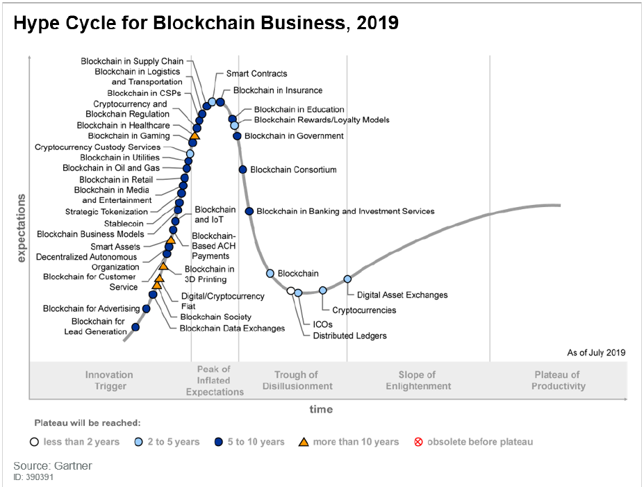

> **一番码客 : 挖掘你关心的亮点。**
> **http://www.efonmark.com**

本文目录：

[TOC]

<!--more-->

## 区块链技术现状

区块链是一组技术的合集， 货币论， 计算机科学， 密码学， 博弈论，分布式系统等技术的合集。

根据Gartner 2019区块链商业化技术成熟度曲线来看，区块链绝对是一个跨产业的技术，会深入到各个领域，而在未来的10年，特别是未来的5到10年，会对各行各业产生变革性的影响。

开源课程对区块链技术现状的描述依然适用：

- 区块链底层技术还很不成熟。
- 我们对价值互联网的认知还很肤浅。
- 市场的情绪游走在狂热和绝望之间。
- 基于区块链的新型生产关系必将重构商业生态。
- 创新无捷径， 唯有多尝试。

## 区块链学习的路线图

### 基本功

在之前一篇github上的区块链项目的文章中我们可以看到当前区块链项目的主流开发语言。

区块链技术不是架于高空之上，而一定是基于现有技术之上，因此我们需要有一定现有传统技术的基础。

- 熟悉传统企业级业务和分布式技术，如springboot/springcloud
- 熟悉nodejs
- 熟悉html/css/javascript

### 比特币白皮书

- Transactions
- Timestamp server
- Proof of work
- Network
- Incentive

### 以太坊

- Solidity智能合约
- Truffle
- Ganache Mocha

### Hyperledger fabirc

- docker
- Nodejs链码
- 业务分析
- 产品经理

### Hpyerledger compose

- Nodejs
- CTO

## 智能物联网+区块链的技术栈

* Vue/react的前端
* Nodejs的中间件
* JavaEE springboot的微服务
* Springcloud的分布式
* Hyperledger的项目实战
* Docker的devops开发
* Android things IOTA物联网

## 参考

* 黑马程序员 120天全栈区块链开发 开源教程

  > https://github.com/itheima1/BlockChain
  
* Gartner 2019 Hype Cycle for Blockchain Business Shows Blockchain Will Have a Transformational Impact across Industries in Five to 10 Years

    > https://www.gartner.com/en/newsroom/press-releases/2019-09-12-gartner-2019-hype-cycle-for-blockchain-business-shows

----

> **一番雾语：还可以分析招聘网站的技能需求来认清当前区块链的现状和学习路线。**

----------

> **免费知识星球： [一番码客-积累交流](http://www.efonmark.com/efonmark-blog/readme/zhishixingqiu1.png)**
> **微信公众号：[一番码客](http://www.efonmark.com/efonmark-blog/readme/guanzhu_1.jpg)**
> **微信：[Efon-fighting](http://www.efonmark.com/efonmark-blog/readme/weixin.jpg)**
> **网站： [http://www.efonmark.com](http://www.efonmark.com)**